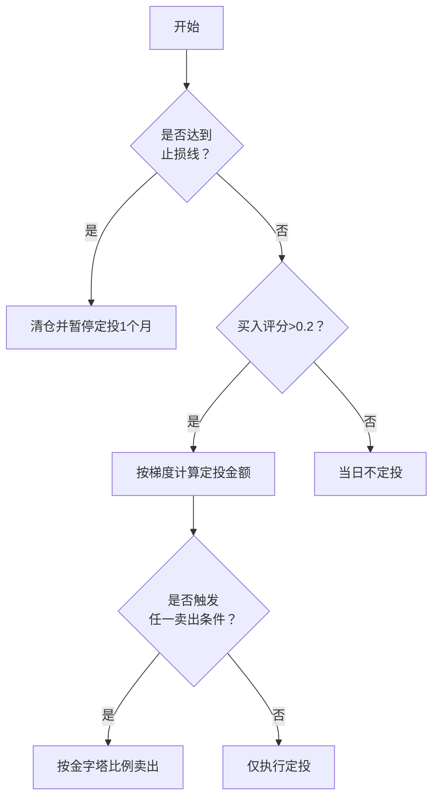

思考过程:

我们设计一个基金定投策略，需要综合考虑多个因素：历史数据、当日相对于大盘的回撤情况、当日的实时预估值等。策略的目标是每日分析，决定是否定投一定数量的资金，或者卖出部分或全部份额以获取收益。
 策略思路：
 1. 定投基础：设置一个基础定投金额（base_amount），一般情况下每天定投这个金额。
 2. 动态调整：根据市场情况调整定投金额，甚至决定卖出。
 具体考虑以下指标：
 a. 历史数据：我们可以考虑基金的历史净值，比如过去N天（例如60个交易日）的净值走势，计算其均线（如20日均线、60日均线）以及当前净值相对于均线的位置（比如是否低于均线一定比例）。
 b. 当日相对于大盘的回撤情况：计算当日基金预估净值相对于前一日净值的涨跌幅，同时计算大盘（比如沪深300指数）的涨跌幅。如果基金的回撤大于大盘，说明基金相对弱势，可能是一个较好的买入机会；如果基金的回撤小于大盘（即相对抗跌），则可能是基金相对强势的表现。
 c. 当日实时预估值：基金在交易时间会有实时预估净值，我们可以根据这个预估值来判断当天的走势。如果预估净值比前一日下跌较多，可能是一个买入机会；如果上涨较多，则可以考虑卖出。
 具体策略设计：
 一、买入策略（定投调整）：
 我们设定一个基础定投金额（base_amount），然后根据以下情况调整：
 1. 均线策略：
    - 计算20日均线（MA20）和60日均线（MA60）。
    - 如果当前净值低于MA20，则加大定投金额（例如1.5倍基础金额）。
    - 如果当前净值低于MA60，则加大更多（例如2倍基础金额）。
    - 如果当前净值高于MA20且低于MA60，按基础金额定投。
    - 如果当前净值高于MA60，则减少定投金额（例如0.5倍基础金额），甚至停止定投。
 2. 相对大盘回撤策略：
    - 计算基金当日预估涨跌幅（fund_change）和大盘当日涨跌幅（index_change）。
    - 计算相对回撤：relative_drawdown = fund_change - index_change
    - 如果relative_drawdown为负（即基金比大盘跌得多），则根据负值的大小进一步增加定投金额（例如，在之前调整的基础上再乘以一个系数，比如1+(-relative_drawdown)的某个倍数，但注意控制上限）。
    - 如果relative_drawdown为正（即基金比大盘跌得少或者涨得多），则维持之前的调整，不做额外增加。
 3. 当日预估净值跌幅：
    - 如果基金当日预估净值下跌超过一定阈值（比如2%），则可以在调整的基础上再增加一部分（比如额外增加50%的定投金额）。
 综合以上，我们可以将买入金额设定为：
   buy_amount = base_amount * (均线调整因子) * (1 + max(0, -relative_drawdown)*k1) + (如果当日预估跌幅超过阈值则额外增加部分)
 其中，k1是一个调整系数，例如0.5。
 二、卖出策略：
 卖出策略主要考虑止盈和止损。
 1. 止盈：
    - 设定目标收益率（例如20%），当持有收益率达到目标收益率时，可以考虑卖出部分或全部。
    - 动态止盈：当收益率创新高后回撤一定比例（例如回撤10%）时卖出。
 2. 止损：
    - 设置最大回撤止损（例如-10%），当持有收益率低于-10%时，考虑止损卖出。
 另外，我们也可以结合市场高估信号：
    - 当基金净值远高于均线（例如高于MA60 20%以上）时，认为高估，可以卖出部分。
 卖出策略可以具体设计为：
   - 当持有收益率 >= 目标收益率（如20%）时，卖出持有份额的50%，同时将目标收益率提高（比如提高到25%），若后续再次达到新的目标收益率，再卖出剩余份额的50%，如此循环。
   - 当从最高收益回撤10%时，卖出剩余份额的50%。
   - 当基金净值高于MA60的20%时，卖出50%的份额（高估信号）。
 同时，我们也可以考虑大盘情况，如果大盘处于高位（比如大盘指数高于其60日均线20%），也可以考虑卖出。
 三、每日操作流程：
 1. 获取数据：
    - 基金前一日的净值、当日的实时预估值（交易时间内）。
    - 大盘指数（如沪深300）前一日的收盘价和当日的实时涨跌幅。
    - 基金的历史净值（用于计算均线）。
 2. 计算指标：
    - 基金20日和60日均线（MA20, MA60）。
    - 基金当日预估涨跌幅：fund_change = (预估净值 - 前一日净值) / 前一日净值
    - 大盘当日涨跌幅：index_change = (大盘当前点数 - 前一日收盘价) / 前一日收盘价
    - 相对回撤：relative_drawdown = fund_change - index_change
    - 当前持有收益率（需要记录持仓成本）。
 3. 买入决策：
    - 根据均线位置确定基础调整因子（factor_ma）：
        if current_net < MA20 and current_net < MA60: factor_ma = 2.0
        elif current_net < MA20: factor_ma = 1.5
        elif current_net < MA60: factor_ma = 1.0   # 注意：这里高于MA20但低于MA60的情况，我们按基础金额，也可以考虑设置为1.0
        else: factor_ma = 0.5   # 高于MA60
    - 相对回撤调整：factor_relative = 1 + max(0, -relative_drawdown) * 0.5   # 这里k1取0.5，即相对回撤每多1%，买入金额增加0.5%
    - 当日跌幅调整：如果fund_change < -0.02（即下跌2%），则额外增加0.5倍的基础金额（extra = 0.5 * base_amount），否则extra=0。
    - 计算买入金额：buy_amount = base_amount * factor_ma * factor_relative + extra
    - 但是，如果基金当日预估净值是上涨的（fund_change>0），我们可以考虑不买入或者按最小金额买入？这里我们可以设定一个规则：当基金当日预估上涨超过1%时，我们不买入（即buy_amount=0）。如果上涨在1%以内，我们按基础调整因子的最小值买入（比如base_amount*factor_ma的最小值，但不超过基础金额）。
    - 因此，调整买入规则：
        if fund_change > 0.01:   # 上涨超过1%
            buy_amount = 0
        else:
            # 按上述公式计算，但注意如果factor_ma为0.5且上涨，那么买入金额也会减少，但我们这里已经排除了上涨超过1%的情况，所以剩下的情况可以按公式计算。
 4. 卖出决策：
    - 计算当前持仓的收益率（假设我们记录每次买入的成本，整体持仓收益率可以用 (当前总市值 - 总成本) / 总成本 计算）。
    - 检查是否达到止盈条件：
        a. 如果当前收益率 >= 目标收益率（初始20%），则卖出当前持仓的50%，同时将目标收益率提高5个百分点（例如变为25%）。
        b. 如果当前收益率从最高收益率回撤了10%（例如最高收益率曾达到30%，现在只有20%），则卖出当前持仓的50%，同时更新最高收益率为当前收益率（卖出后剩余持仓的最高收益率也要更新？可以重新计算剩余持仓的收益率）。
    - 检查是否达到高估卖出条件：
        c. 如果当前基金净值 > MA60 * 1.2，则卖出50%的持仓。
    - 注意：以上卖出条件按顺序检查，满足一个就执行卖出，并不重复卖出（同一天可能满足多个条件，则按顺序执行多次卖出，但通常一天内可能只执行一次卖出，所以我们可以设定一天只执行一次卖出，按优先级执行一个条件）。
 5. 注意事项：
    - 卖出和买入不能同时进行？实际上可以，但为了避免频繁交易，我们可以设定：如果当天有卖出操作，那么就不买入。或者我们可以先处理卖出，然后买入操作正常进行。
    - 我们这里设计为：先处理卖出信号，然后如果卖出了，那么买入操作仍然进行（因为卖出是止盈或止损，而买入是定投，两者并不冲突）。但也可以根据情况调整。
 四、策略参数：
    base_amount：基础定投金额，例如1000元。
    MA窗口：20日和60日。
    目标收益率：初始20%，每次止盈后提高5%。
    回撤止盈：10%。
    高估阈值：高于60日均线20%。
    买入调整参数：k1=0.5（相对回撤调整系数），当日跌幅阈值2%，额外增加0.5倍基础金额。
    当日上涨超过1%则不买入。
 五、持仓记录：
    需要记录每次买入的日期、金额、份额、买入净值，以便计算持仓成本和收益率。
 六、风险控制：
    最大回撤止损：如果持仓收益率低于-10%，则清仓止损。注意：这个止损条件应该在卖出策略中检查。
 因此，卖出策略中增加一条：
    d. 如果当前持仓收益率 <= -10%，则清仓（卖出全部）。
 卖出条件优先级（从高到低）：
    1. 止损（清仓）
    2. 止盈（达到目标收益率或回撤止盈）
    3. 高估卖出
 注意：同一天如果触发多个条件，则按优先级执行（止损最高，然后止盈，然后高估）。
 七、策略代码结构（伪代码）：
 初始化：
    总成本 = 0
    总份额 = 0
    目标收益率 = 0.2   # 初始20%
    历史最高收益率 = -float('inf')   # 记录持仓曾达到的最高收益率
 每日运行：
    获取数据：当前基金实时预估净值，前一日净值，大盘实时涨跌幅，前一日大盘收盘价，基金历史净值（用于计算均线）
    计算：fund_change, index_change, relative_drawdown, MA20, MA60
    # 卖出决策
    current_value = 总份额 * 当日预估净值
    if 总成本 > 0:
        当前收益率 = (current_value - 总成本) / 总成本
    else:
        当前收益率 = 0
    # 更新历史最高收益率
    历史最高收益率 = max(历史最高收益率, 当前收益率)
    # 条件1：止损
    if 当前收益率 <= -0.1:
        卖出所有份额，获得现金
        总份额 = 0
        总成本 = 0
        历史最高收益率 = -float('inf')   # 重置
        # 同时，今天就不再买入了（因为已经清仓）？但策略是定投，所以清仓后可以重新开始。这里我们可以选择卖出后不再买入，或者继续买入。按照策略，我们清仓后，当天仍然可以定投买入。
        # 所以这里我们标记已经卖出，但买入操作继续。
    # 条件2：止盈（目标收益率）
    elif 当前收益率 >= 目标收益率:
        卖出50%的份额（即卖出总份额的一半）
        卖出金额 = 总份额/2 * 当日预估净值
        更新总份额：总份额 = 总份额 / 2
        更新总成本：总成本 = 总成本 / 2   # 因为卖出一半，成本也减半
        目标收益率 += 0.05   # 提高目标收益率5个百分点
        更新历史最高收益率：因为卖出一半，剩余持仓的收益率不变，但历史最高收益率需要重新计算？实际上，我们卖出后，剩余持仓的收益率还是当前收益率（因为卖出前后收益率没变），但是历史最高收益率应该更新为当前收益率（因为卖出后，剩余持仓的最高收益率就是当前这个点）
        历史最高收益率 = 当前收益率   # 注意：卖出后，剩余持仓的当前收益率不变，但历史最高收益率应该调整为当前收益率（因为已经实现了一次止盈，剩余持仓重新开始）
    # 条件3：回撤止盈
    elif 历史最高收益率 - 当前收益率 >= 0.1:   # 从最高点回撤10%
        同样卖出50%的份额，更新总份额和总成本（减半）
        目标收益率不变（因为不是达到目标收益，而是回撤）
        更新历史最高收益率 = 当前收益率   # 卖出后，剩余持仓的历史最高收益率调整为当前收益率
    # 条件4：高估卖出
    elif 当日预估净值 > MA60 * 1.2:
        同样卖出50%的份额，更新总份额和总成本（减半）
        目标收益率不变
        更新历史最高收益率 = 当前收益率   # 同样，卖出后剩余持仓的历史最高收益率调整为当前收益率
    # 买入决策
    if fund_change > 0.01:   # 上涨超过1%，不买
        buy_amount = 0
    else:
        # 计算均线调整因子
        if 当日预估净值 < MA20 and 当日预估净值 < MA60:
            factor_ma = 2.0
        elif 当日预估净值 < MA20:
            factor_ma = 1.5
        elif 当日预估净值 < MA60:
            factor_ma = 1.0
        else:
            factor_ma = 0.5
        # 相对回撤调整因子
        factor_relative = 1 + max(0, -relative_drawdown) * 0.5   # 相对回撤调整系数0.5
        # 当日跌幅额外加仓
        extra = 0
        if fund_change < -0.02:
            extra = 0.5 * base_amount
        buy_amount = base_amount * factor_ma * factor_relative + extra
    # 执行买入：如果buy_amount>0，则用buy_amount买入基金，买入份额 = buy_amount / 当日预估净值
    if buy_amount > 0:
        买入份额 = buy_amount / 当日预估净值
        总份额 += 买入份额
        总成本 += buy_amount
 注意：以上策略中，卖出操作和买入操作在同一天都可能发生。卖出操作在买入操作之前执行。
 八、策略优化点：
    1. 参数优化：均线窗口、调整系数、止盈止损阈值等可以通过历史回测优化。
    2. 可以加入更多指标，如基金估值（PE/PB）等，但需要基金类型支持（如指数基金）。
    3. 考虑交易费用，但定投一般长期持有，交易费用影响较小。
 九、风险提示：
    以上策略仅为示例，实际投资需谨慎。市场有风险，投资需根据个人风险承受能力调整。
 由于这是一个复杂的策略，实际实现时需要获取实时数据，并且需要记录持仓状态。我们可以用程序自动运行，但需要对接数据源和交易接口。
 以上策略设计仅供参考，实际应用中需要根据具体基金的特点进行测试和调整。


以下是一个基于基金历史数据、大盘相对回撤和实时估值的智能定投策略设计。该策略结合了均值回归、动量效应和风险控制，通过量化指标实现自动化决策：

---

### **核心策略框架**
#### **1. 买入条件（三重加权评分）**
```python
def calculate_buy_score(fund, index):
    # 指标1：历史估值分位（30%权重）
    percentile = get_3y_percentile(fund)  # 近3年PE/PB分位
    score1 = max(0, 1 - percentile) * 0.3  # 越低分位得分越高
    
    # 指标2：相对大盘回撤（40%权重）
    fund_drop = (fund.est_nav - fund.prev_nav) / fund.prev_nav
    index_drop = (index.current - index.prev) / index.prev
    relative_drawdown = fund_drop - index_drop  # 基金超额回撤
    score2 = max(0, -relative_drawdown * 5) * 0.4  # 超额回撤越大得分越高
    
    # 指标3：短期动量（30%权重）
    ma20 = fund.hist_nav[-20:].mean()
    ma60 = fund.hist_nav[-60:].mean()
    score3 = 0.3 if ma20 < ma60 else 0  # 20日均线下穿60日均线
    
    return min(1.0, score1 + score2 + score3)  # 总分[0,1]
```

#### **2. 买入金额动态调整**
```python
base_amount = 1000  # 基础定投额
buy_score = calculate_buy_score(fund, index)

# 阶梯式加仓规则
if buy_score >= 0.7:       # 黄金机会
    buy_amount = base_amount * 3
elif buy_score >= 0.4:     # 中等机会
    buy_amount = base_amount * 1.5
elif buy_score >= 0.2:     # 常规定投
    buy_amount = base_amount
else:                      # 暂停定投
    buy_amount = 0
```

#### **3. 卖出策略（金字塔止盈）**
```python
def sell_strategy(holding, fund):
    current_value = holding.shares * fund.est_nav
    profit_ratio = (current_value - holding.cost) / holding.cost
    
    # 条件1：急速冲高（3日内涨超15%）
    if fund.est_nav / fund.hist_nav[-3] > 1.15:
        sell_ratio = 0.5  # 卖出50%
    
    # 条件2：目标收益率达成
    elif profit_ratio >= 0.25:
        sell_ratio = min(0.3, (profit_ratio - 0.2) / 0.5)  # 每涨5%多卖6%
    
    # 条件3：相对大盘高估（近5日基金涨幅>指数150%）
    elif fund_5d_gain > index_5d_gain * 1.5:
        sell_ratio = 0.2
    
    else:
        sell_ratio = 0
    
    return sell_ratio
```

---

### **关键指标计算逻辑**
| **指标**          | **计算方式**                            | **决策意义**                     |
|-------------------|----------------------------------------|----------------------------------|
| **历史分位**      | 近3年PE/PB百分位                       | <30%为低估区域，>70%为高估      |
| **相对回撤**      | (基金日涨跌幅 - 大盘日涨跌幅)          | 负值越大表明超额下跌机会越佳    |
| **均线系统**      | 20日/60日均线交叉                      | 死叉时增强买入信号              |
| **超额动量**      | 基金5日涨幅 / 大盘5日涨幅              | >1.5触发止盈                    |
| **波动率调整**    | 近20日波动率标准差                    | 高波动市场减少定投金额          |

---

### **每日执行流程**
1. **数据获取（15:00前）**  
   - 基金实时预估净值（来自券商API）
   - 大盘指数实时涨跌幅（沪深300/中证500）
   - 基金历史估值数据（T-1日更新）

2. **决策树逻辑**  


3. **特殊场景处理**  
   - **黑天鹅事件**：当日大盘暴跌>5%时，买入评分强制+0.3  
   - **流动性危机**：基金日内成交额<5日均值30%时暂停交易  
   - **分红除权**：自动调整成本价避免信号失真

---

### **风险控制机制**
- **最大回撤止损**：持仓成本回撤15%时清仓  
- **仓位上限**：单只基金持仓不超过总资产20%  
- **冷却机制**：卖出后3个交易日不买入  
- **波动率过滤**：当VIX指数>40时，所有买入金额×0.5

---

### **策略优势**
1. **双维度验证**：同时考量绝对估值（历史分位）和相对价值（大盘对比）  
2. **非线性响应**：市场恐慌时（超额回撤大）呈指数级加仓  
3. **反人性设计**：下跌过程阶梯加码，上涨过程分批止盈  
4. **实时适应性**：通过预估净值捕捉盘中异动

> **注**：实际应用需配合回测优化参数，建议用2018-2023年数据测试不同市场环境表现，重点观察股灾/牛市/震荡市中的资金曲线回撤。可加入夏普比率>1.2、Calmar比率>0.8作为策略生效阈值。